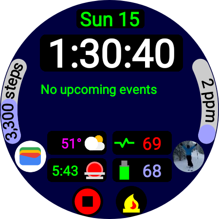

# Philosophy

The first IPhone had a paltry resolution of 320x480, the Galaxy Watch 5 has a resolution of 450x450,
about 30% more pixels. The first digital watch used 7 segment LED displays. So why are we treating
it as just a watch? The word "watch" is about as descriptive for a Galaxy Watch 5 as "phone" is to a
modern Android phone.

If you think about it the "watch face" is simply the place for a default program to run and be
displayed when nothing else is running on the watch (e.g. media player, exercise...). And it has 2
main modes AMBIENT and INTERACTIVE. So while it displays date and time, it should also be a
dashboard of information plus a primary interaction panel (e.g. app launcher).

 Using the Moon Phase complication
from https://github.com/jweygandt/HonestHeartRateComplication would show a nice photo of the moon as
the background, however I don't have permission to share the images, but the code is there less
images.

So with that in mind, I'm breaking some rules and hacking away...

# Recent Changes

2/12/2023 Added first revision of multi event calendar. Currently need to tap the date string on the
watch face to refresh it. Exploring methods to detect calender changes

2/11/2023 The Phone app is now also a ListenerService so it is no longer necessary for it to be
running for the play/pause to work.

2/7/2023 Added detail pages for OpenWeather, OpenWeatherAQI and PurpleAQI.

2/1/23 Refactoring of classes for APIs, OpenWeater and preparing for more. Found that OpenWeater's
AQI API returns values differing with many other sources, so looking for alternatives. Currently
Purple's still works well.

1/30/23 Cleaned up refactoring (Note: the package name changed), tested the code and am using this
version today. For the play/pause complication, got rid of the taponly mode as that was not really
useful. Updated some icons. Added an activity of Open Weather (first cut). Fixed OpenWeatherAQI due
to misunderstanding the API. Moving to Open Weather to the One Call API 3.0 (you will need to update
api keys for that, still free for limited use)

# Play/Pause

A major feature is the ability to pause/resume music with different methods. Imagine listening to
Spotify, on a ski slope, mittens on. You really cannot navigate to Spotify, if needed, and then have
the precision to tap the pause button. Right now by placing Virutal Play/Pause Complication in
position 7 you can toggle it to 2 modes: 1)stop-disabled, 2)tapenabled and visibility enabled. So
with tap enabled you simply tap the screen anywhere other than complicaiton 7 or the music playing
icon and it will toggle play/pause. With visibility enabled, when the watch face becomes visible
play pauses, and when not visible play resumes. Allowing you to run spotify the app, and use buttons
to bring up watch face, and (customised) double press to go to last app. Pause/resume by the button
push. BE SURE TO DISABLE THE SOS MODE on the triple button press. The effort to get to the button
with ski clothes on may not bring the watch out of ambient, so you must do a button press to achieve
that. This means the resume music will be "press-pause-double-press", which sometimes is a triple
press. This feature requires the phone app to be installed, and it installs a ListenerService

# Virtual Complications

In the sense of location aware complications (described below), battery and the play/pause are
special as well. So I have created my own version of Virtual Complications (VComps). Still a work in
progress.

They feature:

* onClick handlers
* methods for Range complcations to color, See AQI Complications
* methods for data expiration (still testing)

# Complication Updates

Since complications can go stale for various reasons, including initial startup, tapping the date
string at the top of the watch will initiate a complication refresh.

# Goals:

* No data collection by 3rd parties, why should a watch face and complications send data to others?
* Digital time to the second, with day-of-week and date
* Location aware complications (see more below)
* As many complications as reasonably possible
  * 4 for display short text and icon
    * Weather, sunrise/sunset, battery, heartrate (I use mine, not Samsungs)
  * 4 for icon only, generally tap-to-launch
    * app and contacts shortcuts
  * 1 large multi-line text, 4 lines
    * calendar, using the OFDCalendar (still a work in progress)
  * 2 range
    * Steps and AQI
  * 1 large full image background
    * Photo images of the moon phase

Currently this is for an audience of 1, so many shortcuts, if others are interested, I'm interested
in hearing from them. As such this is still a HACK and WORK IN PROGRESS, but you are welcome to look
at, copy, and perhaps suggest changes. I do use the watch face daily. I have not given much thought
to the previews and various app/complication icons in editor mode, as I only use that briefly.

I noticed that images, called monochromatic... are really in full color, and that color could be
supported. So why not. Also complication animations, like heartbeat.

I do wish Samsung did better with the complications they deliver, when used with 3rd party watch
faces, but they don't! So I'm also doing some complications myself. You can look at HonestHeartRate.
Their calendar complication works differently in their watch faces as well!!

As to editing complications: For a while I was using the phone app, and it worked, then suddenly
most of the complications disappeared, even for Samsung's watchfaces! So I have buttons. It's
functional, that's about all that can be said. After several weeks, they appear to be back on the
phone.

I tried https://github.com/google/where-am-i and realized that locations don't update very
reliabily. Tested on Galaxy Watch 5. Perhaps some power/permission management for complications,
likely througly undocumented (if not I'd like to read about it). I have seen that location works
fine, if it is run in the process of the WatchFace, provided Priority is set correctly (e.g.
LocationRequest.PRIORITY_HIGH_ACCURACY). Unfortunately that means the complications cannot be
standalone.

Complications included:

* Sunrise/Sunset
* VirtualComplicationPlayPause
* PurpleAQI - Different than the original odbol/air-quality-complication, try to get a certian
  number of samples and then take the median of the samples.
* OpenWeatherAQI (seems to not agree with other sources)
* OpenWeather
* Calendar - manual refresh
* Less used now: Where LocationTest, ComplicationStatus

Activities

* OpenWeatherAQIActivity (touch on OpenWeatherAQI)
* OpenWeaterActivity (touch on OpenWeather)
* PurpleAQIActivity (touch on PurpleAQI)
* Less used: WhereAmI

Thanks to:

* https://github.com/odbol/air-quality-complication
* https://github.com/google/where-am-i
* https://github.com/SebastianSarbu/PizzaWatchFace - for going down the path of "lots of
  complications"
* https://github.com/VladimirWrites/AnalogWatchFace - for simply having some additional open source
  samples of wear-os
* Of course google and wear-os and samples
* Less to Samsung for doing thier own version of Virtual Complications, although I'm sure they
  partnered with Google for wear-os, and of course the hardware
* Thanks for making APIs public:
  * Purple Air
  * OpenWeather
  * AirVisual (still working on that)

So still lots to do, but I'm making it public as there are so few wear os open source projects so
far.

You will need a res/values/api_kes.xml like this (in .gitignore):

```xml
<?xml version="1.0" encoding="utf-8"?>
<resources>
  <string name="purpleair_api_key_read">XXX</string>
  <string name="purpleair_api_key_write">XXX</string>

  <string name="openweather_appid">XXX</string>

  <string name="airvisual_appid" translatable="false"></string>

</resources>
```

# Changes

1/15/22 Did a big cleanup and refactor, even changed the application id. It looks better than the
1/14 code, IT COMPILES, BUT HAS NOT BEEN TESTED, so likely will have some bugs.

1/14/22 At the moment the code is really hacked - very much so!, and will be cleaned up considerably
later, but I'm feeling a need to push the changes to the cloud.

